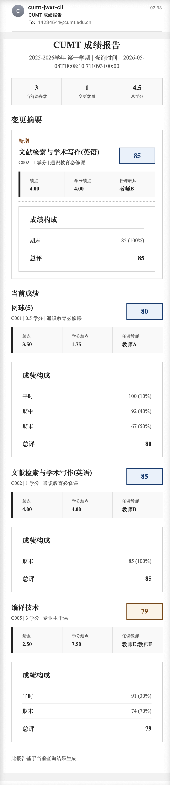

# CUMT-JWXT-CLI


`cumt-jwxt-cli` 是面向 CUMT 教务系统的 Python CLI，用于查询成绩和考试安排、检测成绩变化，并在需要时发送邮件通知。

推荐在服务器上定时运行，或在本地交互式使用。支持配置文件和环境变量，适合自动化脚本和定期检查。

当前主命令：

```bash
cumt-jwxt grades query
cumt-jwxt exams query
```

## 报告示例

下图展示了有新的成绩变更时，邮件发送的效果(重要信息已做混淆)：



## 当前能力

- 读取本地配置和 `CUMT_JWXT_*` 环境变量。
- 使用受控 HTTP session 查询教务系统成绩和考试安排。
- 复用 `state.json` 中的会话 cookie，会话失效后自动重新登录。
- 使用 OpenAI 兼容接口识别验证码，交互式终端下可人工输入。
- 解析成绩列表、检测新增/更新/删除，并生成文本摘要。
- 按需查询成绩详情，生成 HTML 邮件或本地报告。
- 查询考试安排并生成文本摘要。
- 可选保存成绩/考试 JSON、HTML 报告，以及考试 ICS 日历文件。
- 在检测到成绩变化或显式强制时发送 SMTP 邮件。

## 安装

### 克隆仓库

```bash
git clone https://github.com/HeZ2z/cumt-jwxt-cli.git
cd cumt-jwxt-cli
```

项目支持 Python 3.11+。可以使用 `uv`，也可以使用 `pip`；推荐 `uv`。

### 使用 uv（推荐）

```bash
uv sync
uv run cumt-jwxt --help
```

### 使用 pip

如果你不使用 `uv`，也可以直接安装当前项目：

```bash
python -m venv .venv
source .venv/bin/activate
pip install -U pip
pip install .
cumt-jwxt --help
```

本地开发时也可以使用可编辑安装：

```bash
pip install -e .
```

## 快速开始

复制本地配置：

```bash
cp config.example.json config.local.json
```

填写 `config.local.json` 中的教务系统账号、查询学期和验证码识别(若不填写验证码识别的 api 配置，也可以手动输入验证码内容)配置后运行：

```bash
uv run cumt-jwxt grades query
uv run cumt-jwxt exams query
```

适合定时任务的非交互命令：

```bash
uv run cumt-jwxt grades query --config ./config.local.json --no-interactive
uv run cumt-jwxt exams query --config ./config.local.json --no-interactive
```

## 最小配置示例

```json
{
  "cumt": {
    "username": "your-student-id",
    "password": "your-password"
  },
  "query": {
    "year": "2026",
    "semester": "3"
  },
  "captcha": {
    "provider": "openai_compatible",
    "manual_timeout_seconds": 60,
    "openai_compatible": {
      "base_url": "https://your-openai-compatible-endpoint",
      "api_key": "your-api-key",
      "model": "your-model-name"
    }
  },
  "notify": {
    "enabled": false
  }
}
```

敏感字段可以通过环境变量提供，完整配置说明见 wiki。

## 输出文件命名

启用可选输出后，产物文件名会带学年学期后缀，便于多学期并存：

- 成绩 JSON：`grades_<yy><sp|fa>.json`
- 成绩 HTML：`grade_report_<yy><sp|fa>.html`
- 考试 JSON：`exams_<yy><sp|fa>.json`
- 考试 HTML：`exam_report_<yy><sp|fa>.html`
- 考试 ICS：`exam_schedule_<yy><sp|fa>.ics`

其中 `sp` 表示春季学期，`fa` 表示秋季学期。例如 `grades_26sp.json`、`exam_schedule_25fa.ics`。

## 文档

完整使用文档在项目 wiki：

- [Quick Start](https://github.com/HeZ2z/cumt-jwxt-cli/wiki/Quick-Start)
- [Configuration](https://github.com/HeZ2z/cumt-jwxt-cli/wiki/Configuration)
- [Grades Query](https://github.com/HeZ2z/cumt-jwxt-cli/wiki/Grades-Query)
- [Captcha](https://github.com/HeZ2z/cumt-jwxt-cli/wiki/Captcha)
- [Email Notification](https://github.com/HeZ2z/cumt-jwxt-cli/wiki/Email-Notification)
- [Reports and Output](https://github.com/HeZ2z/cumt-jwxt-cli/wiki/Reports-and-Output)
- [Automation](https://github.com/HeZ2z/cumt-jwxt-cli/wiki/Automation)
- [Troubleshooting](https://github.com/HeZ2z/cumt-jwxt-cli/wiki/Troubleshooting)
- [Security and Privacy](https://github.com/HeZ2z/cumt-jwxt-cli/wiki/Security-and-Privacy)
- [Development](https://github.com/HeZ2z/cumt-jwxt-cli/wiki/Development)

## 开发

```bash
uv sync
uv run pytest
uv run ruff check .
```

项目结构：

- `src/cumt_jwxt_cli/cli.py`：CLI 参数解析和命令入口
- `src/cumt_jwxt_cli/config.py`：配置加载
- `src/cumt_jwxt_cli/client/`：登录、session 和 HTTP 交互
- `src/cumt_jwxt_cli/captcha/`：验证码识别
- `src/cumt_jwxt_cli/grades/`：成绩查询、解析、快照、报告
- `src/cumt_jwxt_cli/exams/`：考试安排查询、解析、报告
- `src/cumt_jwxt_cli/notify/`：邮件通知
- `tests/`：pytest 测试

更多开发约定见 [Development](https://github.com/HeZ2z/cumt-jwxt-cli/wiki/Development)。

## 安全说明

不要提交或分享：

- `config.local.json`
- `config.json`
- `state.json`
- `logs/`
- `output/`
- 账号、密码、API Key、cookie、session、验证码图片或真实教务系统响应

项目默认遵循最小必要保存原则，但本地配置、状态文件、日志、邮件服务商和代理环境仍可能引入额外风险。使用前请阅读 [Security and Privacy](https://github.com/HeZ2z/cumt-jwxt-cli/wiki/Security-and-Privacy)。

## 免责声明

本项目仅用于个人自动化查询本人教务成绩信息。使用者应自行确保遵守学校教务系统使用规范，控制查询频率，并妥善保管本地配置、状态文件和邮件账号凭据。

## 许可证

本项目使用 [MIT License](LICENSE)。
